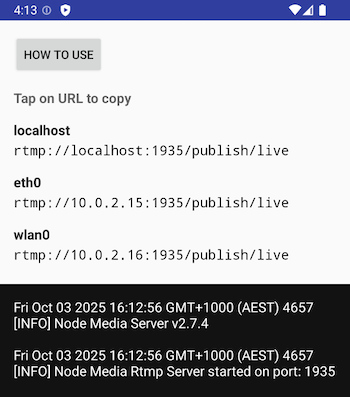

# MediaSrvr - run RTMP media server as an Android app

[](https://play.google.com/store/apps/details?id=com.dimadesu.mediasrvr)

Publish and watch streams to/from RTMP server that is running on an Android device. This app automatically generates RTMP URLs to use for each network the device is on. Copy URLs by tapping on them. Find instructions on how to use it inside the app.

Intended usage is mainly with [LifeStreamer](https://github.com/dimadesu/LifeStreamer) app, but can be used for anything you want really.



## Apps that can work together

See the [demo video on YouTube](https://www.youtube.com/watch?v=_zlWsQYxrE4).

- MediaSrvr - Runs RTMP server on Android phone. You can publish RTMP stream to it from an action camera, for example.
- [LifeStreamer](https://github.com/dimadesu/LifeStreamer) - Can use RTMP as source: playback RTMP stream from server and restream it as SRT with great dynamic bitrate.
- [Bond Bunny](https://github.com/dimadesu/bond-bunny) - You can use LifeStreamer to publish SRT stream into Bond Bunny app. Bond Bunny accepts SRT as input and forwards packets to SRTLA server like Belabox Cloud. Uses multiple networks to improve stream quality.

Share ideas or report issues in Discord https://discord.gg/2UzEkU2AJW or create Git issues.

Uses:

- [Node Media Server v2](https://github.com/illuspas/Node-Media-Server/tree/v2).
- Runs NMS using [Node.js mobile](https://github.com/nodejs-mobile/nodejs-mobile).
- Project is based on [Node.js mobile sample app](https://github.com/nodejs-mobile/nodejs-mobile-samples/tree/master/android/native-gradle-node-folder) - needed a lot of updates.

## How to install

### Google Play Store

You can install app from Google Play Store. Follow [this link](https://play.google.com/store/apps/details?id=com.dimadesu.mediasrvr).

#### Become alpha tester (aka "closed testing")

Please join alpha testing to test early versions of the app. More details [here](https://gist.github.com/dimadesu/00283dc48a672d6d9468126adeaf8566).

### GitHub releases

I was originally releasing .apk files using [GitHub releases](https://github.com/dimadesu/MediaSrvr/releases). I plan to continue releasing on GitHub as a backup.

- Open [GitHub Releases page](https://github.com/dimadesu/MediaSrvr/releases) on your Android device.
- Download APK file.
- Install.
- Enjoy!

## How to Use

### Stop/start

RTMP server starts automatically when the app is opened.

To stop the server tap the button in the notification.

### Publish and play streams on the same device

To publish from a streaming app on your phone to the server on the same phone use this URL:

```
rtmp://localhost:1935/publish/live
```

Play streams on the same device using the same URL. Use an app like VLC player.

### Publish stream from another device to your phone

For example, to publish stream from an action camera to the server on your phone:

- Your phone and action camera have to be on the same Wi-Fi.
- You can create Wi-Fi hotspot with your phone.
- The app builds RTMP URLs for each network that the phone is connected to.
- Configure action camera to connect to the Wi-Fi hotspot and publish to the RTMP URL that is not `localhost`.

### Exclude an app from battery optimisations

To make sure Android does not limit the app in any way when it's running in the background, go to Settings > Apps > [Select App] > Battery > Unrestricted.
